	

	
	

 

## About

I am **Aadil Gugarman**, a frontend developer focused on building clear, responsive experiences with React. I am completing my BCA at Uttaranchal University while expanding into Node.js, APIs, databases, and modern full-stack development.

My work sits at the intersection of thoughtful interface design and practical product engineering: small experiments, real-world platforms, and systems that become more useful with every iteration.

## Toolkit

### Frontend

	

### Backend & Data

	

### Other

	

## Selected Work

<table>
	<tr>
		<td width="50%" valign="top">
			<h3>Aaiza-Fashion</h3>
			
Fashion-focused web project exploring product presentation and storefront interactions.

			HTML · CSS · JavaScript  
			<a href="https://github.com/AadilGugarman/Aaiza-Fashion">View repository →</a>
		</td>
		<td width="50%" valign="top">
			<h3>College Admission System</h3>
			
Online admission workflow for registration, applications, document uploads, status tracking, and admin management.

			Node.js · Express.js · EJS · Database  
			<a href="https://github.com/AadilGugarman/College-admission-management-system">View repository →</a>
		</td>
	</tr>
	<tr>
		<td width="50%" valign="top">
			<h3>Portfolio Website</h3>
			
Personal portfolio presenting projects, skills, and developer work in a focused web experience.

			HTML · CSS · JavaScript  
			<a href="https://github.com/AadilGugarman/my-portfolio">Source</a> · <a href="https://my-portfolio-zeta-steel-94.vercel.app">Live demo</a>
		</td>
		<td width="50%" valign="top">
			<h3>Namaz Times Platform</h3>
			
A platform for managing and presenting prayer times with frontend and backend modules.

			React · Node.js · REST APIs · MySQL  
			Repository link not publicly available
		</td>
	</tr>
	<tr>
		<td width="50%" valign="top">
			<h3>Airbnb Clone</h3>
			
Vacation rental platform built around MERN principles with authentication and full-stack flows.

			MongoDB · Express.js · React · Node.js  
			<a href="https://github.com/AadilGugarman/airbnb-clone-OnlineUU-project">View repository →</a>
		</td>
		<td width="50%" valign="top">
			<h3>Mini Projects</h3>
			
Focused builds that sharpen frontend fundamentals through familiar, interactive products.

			Amazon · Spotify · Currency Converter · Games  
			<a href="https://github.com/AadilGugarman/amazon-clone">Amazon</a> · <a href="https://github.com/AadilGugarman/spotify-clone">Spotify</a> · <a href="https://github.com/AadilGugarman/currency-convertor">Currency</a> · <a href="https://github.com/AadilGugarman/Rock-Paper-Scissors">Games</a>
		</td>
	</tr>
</table>

## Currently Learning

	

## Experience

| Role | Organization | Period |
| --- | --- | --- |
| **Web Development Intern** | SyncWave Corporation | Jul 2025 – Present |
| **Medical Representative** | Sahajanand Life Science Pvt. Ltd. | Feb 2023 – Mar 2026 |
| **Customer Service Representative** | Futwork | Mar 2023 – Apr 2023 |
| **Basic Accountant** | M Umar Exporter | Jun 2020 – Jan 2023 |

## Education & Coursework

- **BCA**, Uttaranchal University · 2023–2026
- **12th Science**, Knowledge High School, Nadiad · 2014

**Coursework:** Data Structures & Algorithms · Web Development · Database Management Systems · Computer Networks

## Achievements

- **JEE Main 2014:** Score 139, eligible for JEE Advanced
- **Technical Awareness Conference:** IEEE GCET
- **IT Network & Hardware Certification:** Apr 2014 – Mar 2016

## GitHub Activity

	
	

	

	

	

## Let’s Connect

	
	

 

	Building with curiosity. Shipping with intent.

